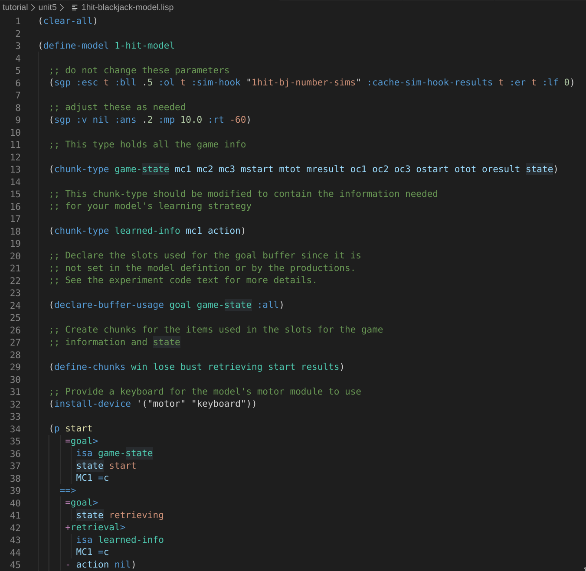

# ACT-R 

This plugin provides proof-of-concept level support for the [ACT-R](http://act-r.psy.cmu.edu/) modelling language.

## Background

This originated out of procrastination of the `tutorial/unit5/1hit-blackjack-model.lisp` assignment as part of the Cognitive Science BSc. Degree at TU Darmstadt in the winter semester 2019/2020.

I had no previous experience writing VS Code plugins, TextMate grammars or Oniguruma Regular Expressions, the latter two most likely being blatantly obvious when looking at the TextMate grammar.

## Features

## Known Issues

In its current state the grammar does not parse the actual ACT-R grammar, but only parts of it and only if they are formatted in a certain form. If some variable or chunk name contains symbols besides `[a-zA-Z0-9\-]` it has a good chance to break. So far the grammar is only guaranteed to cover the `tutorial/unit5/1hit-blackjack-model.lisp` assignment code and any reasonable changes that could be made to it while completing the assignment.

## Potential Future Work

* refactor grammar to a consistent style
* convert to `yaml` based definition because this supports comments
* Implement a task runner to execute models directly from VS Code
  * This is fairly simple and just requires calling `./apps/act-r-64` with various arguments to load initialization scripts (GUI optional) and finally the actually model file
* Problem Matcher to extract warnings and errors from the task runner output
* Extracting the documentation from the reference manual to provide documentation for known functions/options/concepts

It is unlikely that I will invest much more if any time into this but will gladly support anyone who wants to attempt this. Open an issue or a PR for a feature you want to work on and I will be notified via GitHub.

## Release Notes

### 0.0.1

* Initial release of prototype
  * This mostly provides syntax highlighting support for the `tutorial/unit5/1hit-blackjack-model.lisp` assignment 